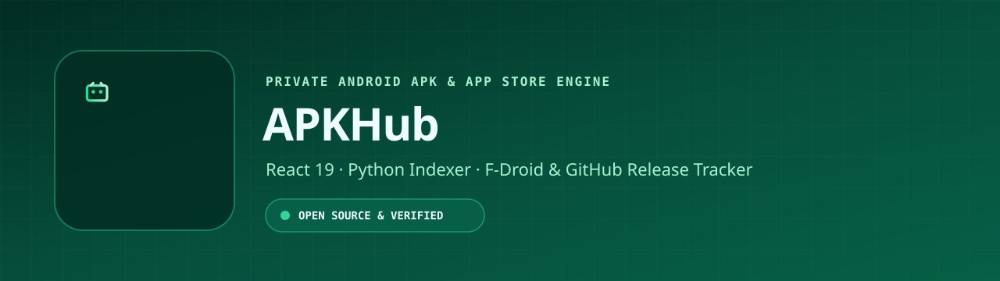

<p align="center">
  
</p>

# 📱 APKHub — Private Android APK Store & Indexer

[](LICENSE)
[](https://github.com/LIN4CRE/AppHub/releases)
[](https://github.com/LIN4CRE/AppHub/releases)

**AppHub** is your personal, open-source gateway to the best Android apps on GitHub. It's a fast, modern "App Store" that finds, indexes, and helps you install apps directly from their official sources.

---

## ✨ Why AppHub?

*   **🛡️ Pure & Official:** We never host or re-distribute files. You always download the official APK directly from the developer's GitHub release.
*   **🚀 Lightning Fast:** Instant search and a smooth interface make finding apps a breeze.
*   **🌗 Eye-Friendly:** Full support for Dark and Light modes.
*   **📱 Native Feel:** Use the web version or install our lightweight Android app for an integrated experience.
*   **📦 Open Source:** Built by the community, for the community. Completely transparent and free.

---

## 📥 Get Started

### For Everyone (Users)
The easiest way to use AppHub is to install the Android app. It handles downloads and installations automatically.

1.  **Download the latest APK** from our [Releases Page](https://github.com/LIN4CRE/AppHub/releases).
2.  Open the file on your Android device and follow the prompts to install.
3.  Launch **AppHub** and start discovering!

*Note: You may need to enable "Install from Unknown Sources" in your device settings.*

### For Developers & Tinkerers
Want to host your own version or contribute?

1.  **Clone the Repo:** `git clone https://github.com/LIN4CRE/AppHub.git`
2.  **Run Locally:**
    ```bash
    cd app
    python3 -m http.server 8080
    ```
3.  **Indexing:** The project includes a Python-based discovery engine in `/indexer`.

---

## 🛠️ How it Works

AppHub isn't a mirror—it's a **catalog**.

1.  **Discovery:** Our automated indexer scans GitHub for high-quality Android projects.
2.  **Metadata:** It extracts version numbers, descriptions, and release assets.
3.  **Presentation:** The web interface (PWA) displays this data in a clean, searchable format.
4.  **Delivery:** When you tap "Download", your device talks directly to GitHub's servers to fetch the app.

---

## 📜 License & Philosophy

AppHub is released under the **MIT License**. We believe in the power of the open-source ecosystem and aim to make it easier for users to find and support developers directly.

---
*Built with ❤️ for the Android Community.*
